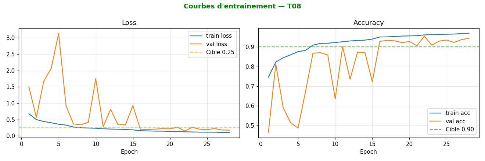
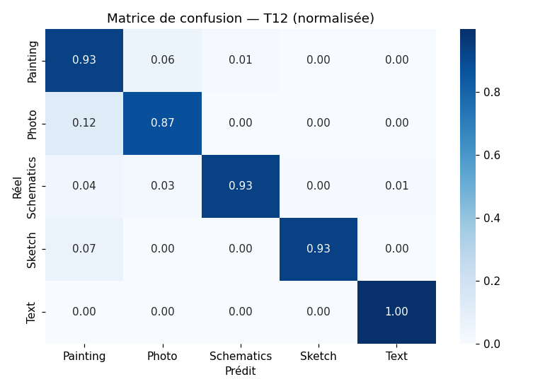
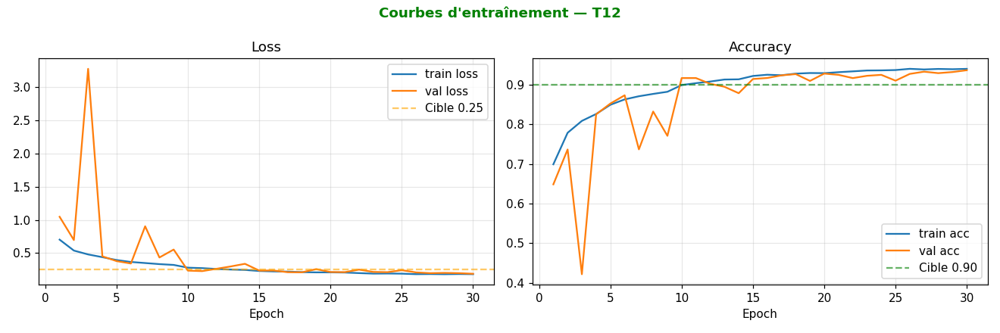
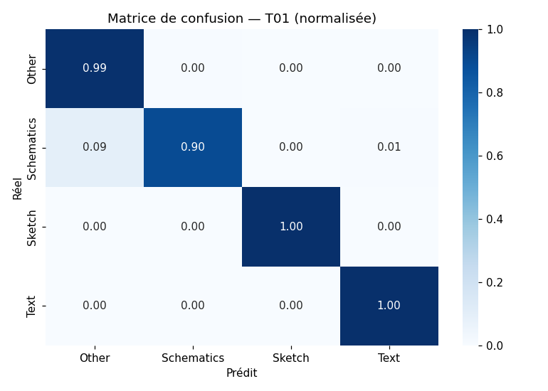
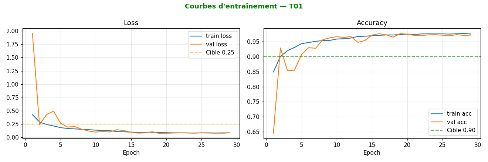
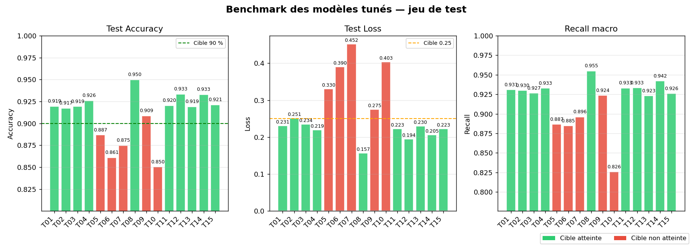
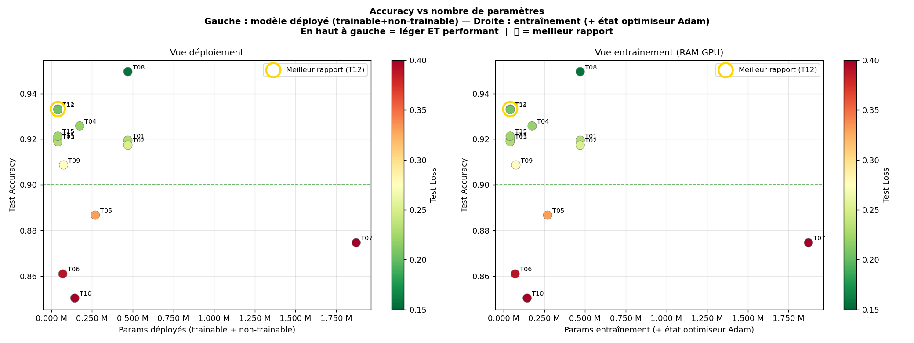
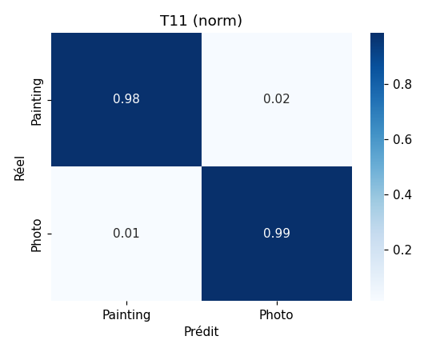

<<<<<<< Updated upstream
# Livrable Final : Classification d'images TouNum
=======
# Livrable Final, Classification d'images TouNum
>>>>>>> Stashed changes

## Introduction et rappel du contexte

L'entreprise **TouNum** est spécialisée dans la numérisation de documents papier à grande échelle (textes, images, archives).
Face à la demande croissante de ses clients possédant des volumes massifs de données historiques et industrielles, 
TouNum souhaite étendre sa gamme de services en intégrant des technologies de Machine Learning et de Deep Learning. 

À terme, l'objectif final est de concevoir un workflow automatisé capable de générer des légendes descriptives de manière automatique (*Image Captioning*). 
Cependant, les flux de documents numérisés en masse à la chaîne intègrent des formats très hétérogènes 
(schémas, textes scannés, dessins, peintures) alors que l'algorithme de captioning final requiert exclusivement des photographies.

### Objectif du Livrable 1 : Classification & Tri
Ce module constitue le **premier jalon critique (Livrable 1)** du projet global. 
Il répond au besoin impératif d'isoler automatiquement les photographies des autres types de documents en amont de la chaîne de traitement. 

Pour ce faire, nous exploitons un dataset d'images supervisé et catégorisé fourni par TouNum. 
L'enjeu majeur de ce livrable consiste à maximiser la précision de détection des photos tout en gérant la frontière fine et complexe séparant une photographie, d'une peinture réaliste, d'un dessin, un croquis ou un texte.
## Aspects techniques :

Pipeline de classification d'images en 5 classes (Painting, Photo, Schematics, Sketch, Text) avec un second étage binaire pour raffiner la distinction Painting/Photo.
---

### 1. Préparation

#### Dataset

Placer le dataset à la racine du projet :

```
Livrable Final/
├── Dataset/Dataset/
│   ├── Painting/
│   ├── Photo/
│   ├── Schematics/
│   ├── Sketch/
│   └── Text/
```

#### Dépendances

```bash
pip install -r requirements.txt
```

Le `requirements.txt` fourni utilise `tensorflow_rocm` (compilé pour GPU AMD). Si votre GPU est NVIDIA ou si vous tournez sur CPU, remplacez `tensorflow_rocm` par `tensorflow` dans le fichier avant l'installation.

---

### 2. Structure du projet

```
Livrable Final/
├── README.md
├── requirements.txt
├── utils.py                          # Constantes + helpers partagés
├── config.json                       # Config globale (classes, img_size, seed)
├── config_benchmark.json             # Config du benchmark final
│
├── 01_data_split_analysis.py         # Split + EDA + cleaning (doublons, corrompues)
│
├── 02_train_multiclass_model.py      # Entraînement avec params custom (optionnel, voir §5)
├── 02_multiclass_model/
│   ├── config_multiclass.json        # Params utilisés par 02_train (à éditer librement)
│   ├── multiclass_model.py           # Architecture + pipeline tf.data
│   ├── 02_a_tune_multiclass.py       # Optuna : tune ET entraîne les modèles
│   ├── 02_b_analyze_multiclass_tune_results.py  # Résultats tuning + analyse + modèles trial
│   └── tune_multiclass_results/      # Résultats tuning + analyse + modèles trial
│
├── 03_train_binary_model.py          # Entraînement avec params custom (optionnel, voir §7)
├── 03_binary_model/
│   ├── config_binary.json
│   ├── binary_model.py               # MobileNetV2 / EfficientNetB0 en transfer learning 2 phases
│   ├── 03_a_tune_binary.py
│   ├── 03_b_analyze_binary_tune_results.py
│   └── tune_binary_results/
│
├── 04_evaluation_benchmark.py        # Benchmark final pipeline multiclass + binaire
│
└── figures/                          # Figures référencées dans ce README
    ├── eda/                          # Sortie de 01 (à régénérer après run)
    ├── multiclass/
    ├── binary/
    └── tune/
```

---

<<<<<<< Updated upstream
### 3. Pipeline d'exécution
=======
## 3. Ordre d'exécution
>>>>>>> Stashed changes

Toutes les commandes doivent être lancées depuis la racine `Livrable Final/`.

> **Un tuning complet a déjà été effectué.** Trois modèles entraînés sont disponibles dans le dépôt :
> - `02_multiclass_model/tune_multiclass_results/multiclass_best_acc.keras` (T08, meilleure accuracy)
> - `02_multiclass_model/tune_multiclass_results/multiclass_best_efficiency.keras` (T12, modèle léger)
> - `03_binary_model/tune_binary_results/binary_best.keras` (T11, meilleur binaire)
>
> Les hyperparamètres correspondants sont sauvegardés dans les fichiers `*_pretrained.json` de chaque dossier modèle. Le suffixe `_pretrained` les distingue des fichiers `best_*_config.json` générés automatiquement à chaque rerun des scripts d'analyse, qui eux peuvent être écrasés.
>
> **Pour réentraîner un de ces modèles** : copier le `*_pretrained.json` voulu dans `config_multiclass.json` (resp. `config_binary.json`), puis lancer `python3 02_train_multiclass_model.py` (resp. `03_train_binary_model.py`). Inutile de relancer le tuning.

**Important** : les scripts `02_a_tune_multiclass.py` et `03_a_tune_binary.py` entraînent ET sauvegardent un modèle
pour chaque trial. Si vous ne voulez que le meilleur modèle issu du tuning, **vous n'avez pas besoin de relancer les scripts
`02_train_*` / `03_train_*`** : ils sont utiles uniquement pour tester manuellement vos propres hyperparamètres dans
`config_*.json`.

| Étape | Commande | Sortie | Obligatoire ? |
|---|---|---|---|
| 1. Split + EDA | `python3 01_data_split_analysis.py` | `data_split/`, figures EDA | Oui |
| 2a. Tuning multiclass | `python3 02_multiclass_model/02_a_tune_multiclass.py --trials 15` | `tune_multiclass_results/results.json` + modèles | Oui |
| 2b. Analyse multiclass | `python3 02_multiclass_model/02_b_analyze_multiclass_tune_results.py` | `best_acc_config.json`, `best_efficiency_config.json` | Oui |
| 2. Train multiclass custom | `python3 02_train_multiclass_model.py` | `models/multiclass_023_best.keras` | Optionnel |
| 3a. Tuning binaire | `python3 03_binary_model/03_a_tune_binary.py --trials 15` | `tune_binary_results/results.json` + modèles | Oui |
| 3b. Analyse binaire | `python3 03_binary_model/03_b_analyze_binary_tune_results.py` | `best_acc_config.json` | Oui |
| 3. Train binaire custom | `python3 03_train_binary_model.py` | `models/binary_photo_painting_best.keras` | Optionnel |
| 4. Benchmark final | `python3 04_evaluation_benchmark.py` | rapport sur jeu de test | Oui |
| 5. Tri en production | `python3 05_cascade_pipeline.py --input_dir <dossier>` | `Filtered_images/<Classe>/` | Optionnel |

Pour utiliser les scripts `02_train_*` / `03_train_*` : éditer `config_multiclass.json` (resp. `config_binary.json`)
avec **vos propres paramètres** ou copier ceux d'un des fichiers générés (`best_acc_config.json` pour la perf maximale,
`best_efficiency_config.json` pour le modèle léger).

---

### 4. Split & EDA

`01_data_split_analysis.py` fait trois choses essentielles :

<<<<<<< Updated upstream
1. **Détection et exclusion des images corrompues** *avant* le split, via `Image.verify()` : les images cassées ne sont jamais comptées dans le ratio 70/15/15.
2. **Détection des doublons (MD5)** intra et inter-classes : évite le data leakage entre train/val/test.
=======
1. **Détection et exclusion des images corrompues** *avant* le split, via `Image.verify()`. Les images cassées ne sont jamais comptées dans le ratio 70/15/15.
2. **Détection des doublons (MD5)** intra et inter-classes. Évite le data leakage entre train/val/test.
>>>>>>> Stashed changes
3. **Split 70/15/15** stratifié par classe avec seed fixe, puis resize 224×224 en JPEG qualité 95.

L'EDA inclut :
- Distribution des classes (équilibre)
- Distribution des dimensions et modes d'images
- Échantillons visuels par classe

Les figures sont sauvegardées dans `figures/` (à régénérer en lançant `01_data_split_analysis.py`).

---

<<<<<<< Updated upstream
### 5. Modèle multiclass : pourquoi 5 classes et non 4 ?
=======
## 5. Modèle multiclass, pourquoi 5 classes et non 4

```bash
# Tuning : entraîne et sauvegarde un modèle par trial
python3 02_multiclass_model/02_a_tune_multiclass.py --trials 15

# Analyse : génère best_acc_config.json et best_efficiency_config.json
python3 02_multiclass_model/02_b_analyze_multiclass_tune_results.py

# OPTIONNEL : tester vos propres hyperparamètres
# (éditer 02_multiclass_model/config_multiclass.json, puis :)
python3 02_train_multiclass_model.py
```
>>>>>>> Stashed changes

Une variante du modèle a été testée en regroupant Painting + Photo dans une classe "Other" (4 classes), pour déléguer la distinction Painting/Photo au binaire en aval. Bien que cette approche améliore l'accuracy globale (0.948–0.972 vs 0.850–0.950), **elle dégrade la précision sur Schematics** (recall 0.82–0.91 vs 0.91–0.95 en 5 classes).

Le coût d'erreur sur Schematics est trop élevé pour notre cas d'usage : si un Schematics est classé "Other" par le 4 classes, il est ensuite envoyé au binaire qui le classera forcément Painting ou Photo (le binaire n'a pas de sortie "ni l'un ni l'autre"). Cette fuite contamine la sortie finale.

**Architecture retenue** : 5 classes en amont, puis si la prédiction est Painting ou Photo, l'image passe par le binaire pour raffiner. Le 5-class apprend directement la frontière Schematics/Photo (confusion ~3-4% seulement), donc beaucoup moins de Schematics atteignent le binaire.

#### Matrices de confusion comparatives

| Modèle | Matrice | Curves |
|---|---|---|
<<<<<<< Updated upstream
| 5 classes (T08 : meilleur) |  |  |
| 5 classes (T12 : alternatif) |  |  |
| 4 classes (T01 : meilleur écarté) |  |  |

---

### 6. Deux modèles multiclass retenus : performance vs efficacité

Deux configurations sont conservées :

- **T08 : Performance maximale** : meilleur compromis accuracy/loss/recall (test_acc ≈ 0.950)
- **T12 : Modèle léger** : ~120K paramètres seulement, accuracy ≈ 0.933
=======
| 5 classes (T08, meilleur) |  |  |
| 5 classes (T12, plus efficient) |  |  |
| 4 classes (T01, meilleur écarté) |  |  |

---

## 6. Deux modèles multiclass retenus, performance vs efficacité

Deux configurations sont conservées :

- **T08, Performance maximale** : meilleur compromis accuracy/loss/recall (test_acc ≈ 0.950)
- **T12, Modèle léger** : ~120K paramètres seulement, accuracy ≈ 0.933
>>>>>>> Stashed changes

#### Pourquoi un modèle léger ?

L'inférence à grande échelle a un coût énergétique non négligeable. Un modèle 10× plus petit consomme proportionnellement moins d'électricité par prédiction. Pour un déploiement en production (mobile, edge, traitement de masse), privilégier un modèle compact réduit l'empreinte carbone tout en conservant 93%+ d'accuracy. C'est un arbitrage explicite : -2 points d'accuracy contre -90% de paramètres.

#### Comparatif tuning





Sur ce dernier graphique, T12 illustre clairement le compromis : à gauche du nuage de points (peu de paramètres) mais au-dessus de la cible 0.90.

---

<<<<<<< Updated upstream
### 7. Modèle binaire (Painting vs Photo)
=======
## 7. Modèle binaire, Painting vs Photo

```bash
# Tuning : entraîne et sauvegarde un modèle par trial
python3 03_binary_model/03_a_tune_binary.py --trials 15

# Analyse : génère best_acc_config.json
python3 03_binary_model/03_b_analyze_binary_tune_results.py

# OPTIONNEL : tester vos propres hyperparamètres
# (éditer 03_binary_model/config_binary.json, puis :)
python3 03_train_binary_model.py
```
>>>>>>> Stashed changes

Le binaire est un transfer learning 2 phases (EfficientNetB0, base gelée puis fine-tuning) qui raffine la distinction la plus difficile du problème.

**Observation clé du tuning** : MobileNetV2 s'effondre systématiquement sur ce problème (val_acc ~0.50, prédit une seule classe). Seul EfficientNetB0 converge. Le tuning final ne devrait explorer que ce backbone.

<<<<<<< Updated upstream
Meilleur trial : T11 : test_acc 0.983, test_auc 0.997.
=======
Meilleur trial : **T11**, test_acc 0.983, test_auc 0.997.
>>>>>>> Stashed changes



---

### 8. Tensorboard

<<<<<<< Updated upstream
Depuis la racine du projet : 
```tensorboard --logdir logs```.

Pour le run :
```http://localhost:6006```.

### 9. Benchmark

`04_evaluation_benchmark.py` évalue la pipeline complète (multiclass -> binaire si Painting/Photo) sur le jeu de test. Configuration dans `config_benchmark.json` (chemins des modèles à benchmarker).

### 10. Benchmark Cascade
En complément du benchmark et de l’évaluation sur dataset figé, un script de cascade pipeline en inférence réelle est fourni afin de tester le modèle sur des images totalement inconnues.

Ce script (05_cascade_pipeline.py) permet de fournir un dossier d’images via argument CLI (--input_dir). Chaque image est ensuite traitée par le modèle de classification multiclasses (5 classes). Lorsque la prédiction appartient aux classes les plus ambiguës (Photo ou Painting), une seconde étape de raffinement est déclenchée via un modèle binaire spécialisé (Painting vs Photo), afin d’améliorer la précision sur cette frontière critique.

Les images sont ensuite automatiquement triées et copiées dans un dossier de sortie (--output_dir, par défaut Filtered_images/) organisé par classe prédite :
```
Filtered_images/
├── Photo/
├── Painting/
=======
`04_evaluation_benchmark.py` évalue la pipeline complète (multiclass → binaire si Painting/Photo) sur le jeu de test. Les modèles utilisés sont ceux déclarés dans `config_pipeline.json`.

---

## 9. Utilisation en production — tri d'un dossier d'images

`05_cascade_pipeline.py` applique la pipeline entraînée sur un dossier d'images quelconques et les trie automatiquement dans des sous-dossiers par classe.

```bash
python3 05_cascade_pipeline.py --input_dir <dossier_images> [--output_dir <dossier_sortie>]
```

**Fonctionnement :**
1. Toutes les images du dossier `--input_dir` sont parcourues récursivement.
2. Chaque image passe par le modèle multiclass (5 classes).
3. Si la prédiction est Painting ou Photo, l'image est renvoyée au binaire pour affiner.
4. L'image est copiée dans `output_dir/<Classe>/`.

**Structure de sortie :**
```
Filtered_images/       ← dossier par défaut, modifiable avec --output_dir
├── Painting/
├── Photo/
>>>>>>> Stashed changes
├── Schematics/
├── Sketch/
└── Text/
```

<<<<<<< Updated upstream
## Conclusion Générale et Bilan
Le travail d'ingénierie et de recherche mené dans ce premier livrable valide la viabilité du tri automatisé pour la chaîne de production de TouNum. Face au défi technique posé par la variété structurelle des données, la conception d'un système d'architecture en cascade a prouvé sa supériorité face aux approches naïves.

#### Synthèse des Choix Structurants et Performances
Garantie de l'intégrité des données : L'implémentation de filtres rigoureux en amont (nettoyage MD5 anti-fuite et Image.verify()) assure que l'apprentissage repose exclusivement sur des signaux mathématiques fiables, supprimant le biais de surapprentissage lié aux doublons.

- Stratégie métier orientée 5 classes : Le choix d'exécuter un classifieur 5 classes en premier niveau protège la catégorie sensible Schematics (maintien d'un rappel élevé entre 0.91 et 0.95). Cela empêche les fuites de documents techniques vers le second étage, un écueil fonctionnel majeur observé lors de l'expérimentation du modèle à 4 classes.

- Arbitrage Industriel (Modèles T08 vs T12) : L'entreprise dispose désormais d'une flexibilité technique totale :

    - La configuration T08 offre une précision de pointe (test_acc ≈ 0.950) pour maximiser la qualité globale du tri.

    - La configuration T12 répond à des contraintes de sobriété numérique et d'efficacité de calcul en production de masse, 
réduisant le volume des paramètres de 90% pour une concession d'exactitude minime de seulement 1.7%.

- Résolution de la frontière Critique (Photo / Painting) : 
L'intégration d'un réseau expert binaire basé sur un modèle pré-entraîné EfficientNetB0 résout la confusion la plus complexe du dataset. 
Les performances obtenues sur le jeu de test (Exactitude de 98.3% et AUC de 0.997) sécurisent l'isolation quasi parfaite des photographies attendues par TouNum.

Perspectives et Alignement avec le Jalon Suivant (Livrable 2)
L'implémentation robuste de ce premier bloc de classification permet de figer l'étape d'aiguillage des données. 
Le flux opérationnel validé de TouNum s'oriente désormais vers le Livrable 2 : Traitement et Débruitage d'images.

Les photographies ayant été correctement isolées et filtrées par notre pipeline binaire, 
elles présentent néanmoins des défauts inhérents à une numérisation industrielle à la chaîne (bruit numérique, grain de compression, léger flou de balayage). 
La prochaine phase consistera donc à développer un réseau de neurones de type Auto-encodeur Convolutif (CAE). 
Ce modèle agira comme un filtre de débruitage intelligent (Denoising Autoencoder) pour restaurer et uniformiser la qualité visuelle des clichés.
=======
Les scripts 04 et 05 lisent leurs modèles depuis `config_pipeline.json` à la racine — **c'est le seul fichier à modifier** pour changer de modèles. Il ne contient que les deux chemins. Le script doit être lancé depuis la racine `Livrable Final/`.
>>>>>>> Stashed changes
